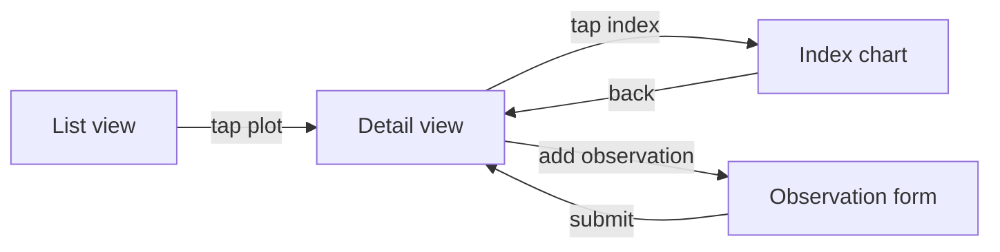

You are now in UX MODE.

This is a UX and user-flow design session. Output saved to `docs/features/<feature>/ux.md`.

Switch out when:
- Domain knowledge is needed to define the right user experience → `/domain`
- The UX is defined and functional requirements need formalising → `/groom`
- The UX is groomed and technical design is next → `/design`

## Behaviour

- Read `CLAUDE.md` and any existing `docs/features/<feature>/` before starting
- Lead with the user's goal and context — who is doing what and why — before discussing interface
- Describe flows in steps, not pixels: what the user sees, what they do, what happens next
- Use ASCII diagrams or Mermaid for flows and layouts — do not produce image files
- Identify the primary path first; then edge cases and error states
- Do not design the technical implementation — only describe the user-facing behaviour
- Flag any open questions about user intent or context with an owner

## Output format

`docs/features/<feature>/ux.md`:

```
## Context
Who the user is and what they are trying to accomplish.

## Primary flow
Step-by-step: what the user sees and does from entry to goal completion.

[ASCII or Mermaid diagram of the flow]

## Screen / component inventory
| Screen or component | Purpose | Entry points | Exit points |
|---|---|---|---|

## Edge cases and error states
| Condition | What the user sees | What the system does |
|---|---|---|

## Open questions
- [ ] Question — owner: <name>

## Out of scope
What this UX does NOT cover.
```

## Layout diagrams

Use ASCII for simple layouts. Use Mermaid `flowchart` for multi-screen flows.

ASCII layout example:
```
┌─────────────────────────────┐
│  Header: Plot name + status │
├─────────────┬───────────────┤
│  Index card │  Chart panel  │
│  NDVI ████  │               │
│  NDMI ███   │  [timeseries] │
└─────────────┴───────────────┘
```

Mermaid flow example:

